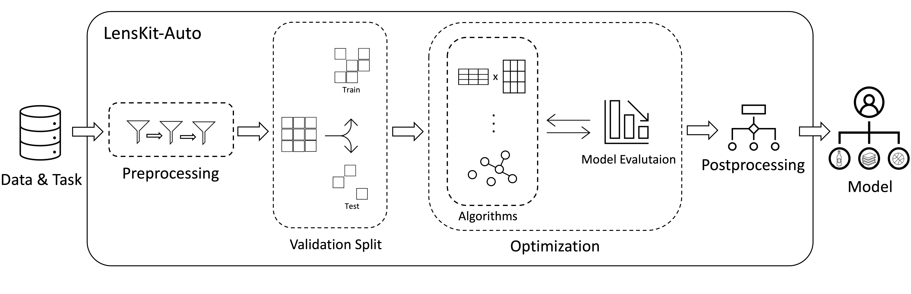

.. lenskit-auto documentation master file, created by
   sphinx-quickstart on Tue Feb 21 23:11:49 2023.
   You can adapt this file completely to your liking, but it should at least
   contain the root `toctree` directive.

Welcome to Lenskit-Auto's documentation!
========================================

`LensKit-Auto <https://github.com/ISG-Siegen/lenskit-auto>`_
is a flexible Automated Recommender System (AutoRecSys) toolkit
based on `LensKit <https://github.com/lenskit/lkpy>`_. LensKit-Auto is
open-source and performs automated algorithm selection, hyperparameter
optimization, and post-hoc model ensembling on all algorithms included
in the LensKit Python library for rating prediction and Top-N ranking
datasets.

LensKit-Auto strives to maintain a test coverage of more than
90\% at all times. In comparison to other AutoRecSys tools, a Recommender
Systems developer using LensKit-Auto does not need to spend time on defining
configuration files or hyperparameter settings but only needs to execute a
single line of code. LensKit-Auto then outputs the best-performing model for
the specific dataset.

License
~~~~~~~
LensKit-Auto is licensed under the MIT license. See `LICENSE <https://github.com/ISG-Siegen/lenskit-auto/blob/main/LICENSE.md>`_

~~~~~~~

.. toctree::
   :maxdepth: 2
   :caption: Overview:

.. toctree::
   :maxdepth: 2
   :caption: Getting Started:

   Getting_Started

.. toctree::
   :maxdepth: 1
   :caption: SIGIR23-Demo:

   SIGIR23-Demo

.. toctree::
   :maxdepth: 2
   :caption: API Reference:

   lkauto

Indices and tables
==================

* :ref:`genindex`
* :ref:`modindex`
* :ref:`search`
